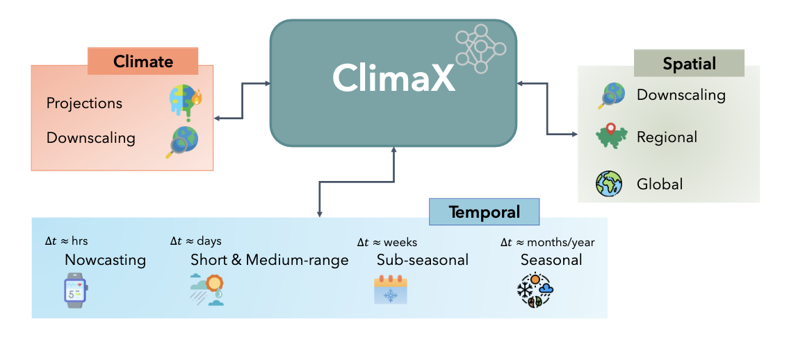
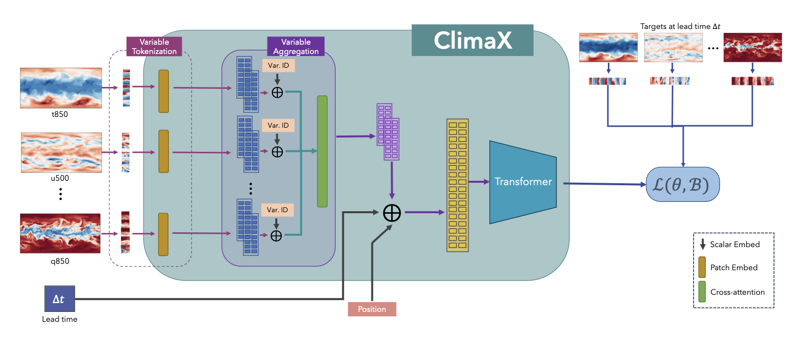

# ClimaX

> [Paper](https://arxiv.org/abs/2301.10343) | [Code](https://github.com/microsoft/ClimaX)

ClimaX is a foundation model designed to be pre-trained on heterogeneous data sources and then
fine-tuned to solve various downstream weather and climate problems. 

The set of climate and weather
variables is extremely broad, and predictions may be required for regional or even spatially incomplete
data, even at different resolutions. Current CNN-based architectures are not applicable in these
scenarios, as they require the input to be perfectly gridded, contain a fixed set of variables, and have
a fixed spatial resolution. resolution. Transformer-based architectures, on the other hand, offer much
greater flexibility by treating the image-like data as a set of tokens. As a consequence, the backbone
architecture chosen is a Vision Transformer to provide greater flexibility. 

Two significant changes to this model were implemented. The first change involved variable
tokenization, which includes separating each variable into its own channel and tokenizing the input
into a sequence of patches. The second change was variable aggregation, introduced to speed up
computation by reducing the dimensionality of the input data and to aid in distinguishing between
different variables, thereby enhancing attention-based training.
After combining variables, the vision transformer block can produce output tokens that are then
processed through a linear prediction head to recreate the original image. During the pre-training
phase, a latitude-weighted reconstruction error is used to keep into account the location of the current
patch. For fine-tuning, the ClimaX modules can be frozen, allowing for training only on the intended
part of the architecture. In fact, often only the final prediction head and variable coding modules
need retraining. This model has undergone testing for several downstream tasks, including global and
regional forecasting and prediction for unseen climate tasks.