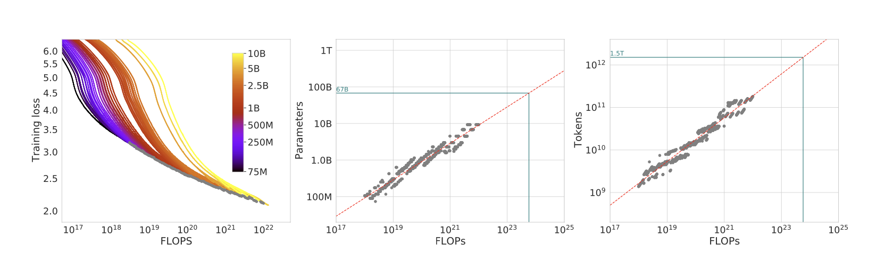
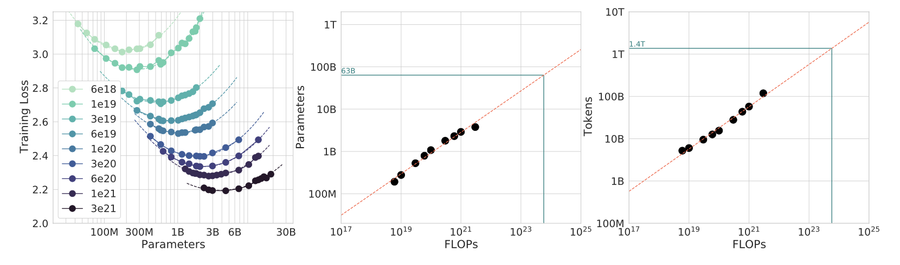
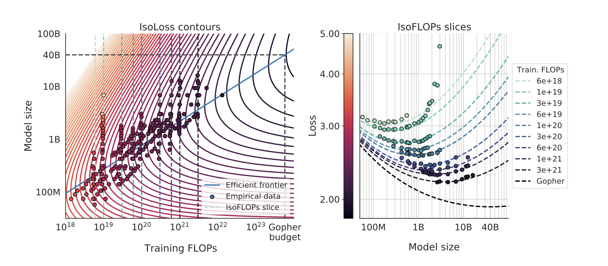

# Training Compute-Optimal Large Language Models

> [Paper](https://arxiv.org/abs/2203.15556)

## Summary

Optimal model size and number of tokens is fixed with the compute budget. 

``` admonish note
Current LLMs are undertrained
```

What is found is that model size N and numbe of tokens D should scale equally. 

\\( 2 \times N \implies 2 \times D \\)





Given a fixed FLOPs budget, how should we tradeoff model size N and training tokens D?
- Fix N and vary D (from 70M to 10B)
- Fix D and vary N (create 16 FLOPs curves (isoFLOPs))
- Fitting a parametric loss function: model all losses as parametric functions of N and D

\\( \hat{L}(N, D) = E + \frac{A}{N^{\alpha}} + \frac{B}{N{\beta}}\\)

where \\(E\\) is the entropy of natural text, the second term indicates how a transformer with N parameters still underperforms, and the third term is the finite number of optimization steps.

This function can be optimized with Huber loss, creating M isoFLOPs slices and isoLoss contours.



## Optimal model scaling?

All three approaches yield the same optimal scaling law: to keep C constant, N and D have to scale in a proportional way.
