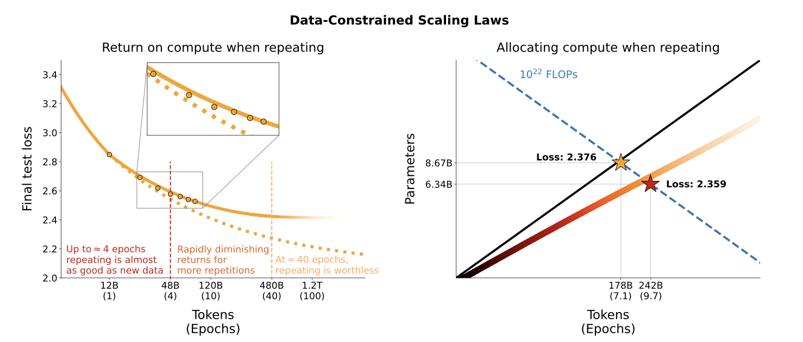
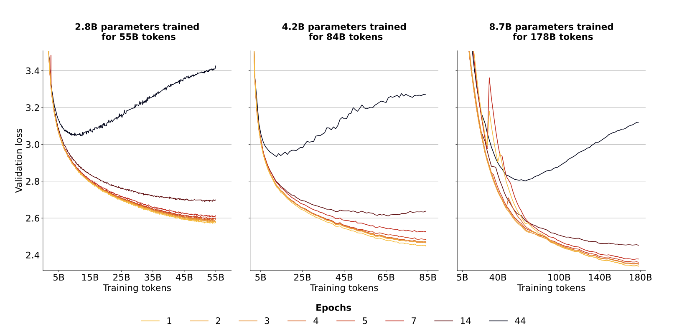

# Scaling Data-Constrained Language Models

> [Paper](https://arxiv.org/abs/2305.16264) | [Code](https://github.com/huggingface/datablations)

## Summary

In a data constrained regime [900B, 9B] parameters, with a fixed data and compute budget, after four epochs, the delta in loss is negligible.
This implies a decreasing value in repeated tokens. 

What is the best **allocation** and **return** for the given C resources?

- **Allocation**: how to distribute the compute budget between the model size and the number of training tokens?
- **Return**: how to measure the gain performance?

Why repeating data? Cause there may not be enough, and it is cheap to generate, but also repetition for the model, that's why we have epochs.

Measure of validation loss for isoFLOPs: too many epochs lead to overfitting. This under any D. 
For most D sizes, it seems 7 epochs is the best amount. 

- **Allocation**: optimized by scaling epochs more than other parameters. 
- **Return**: sizeable when repeating data, after 16 epochs, the gain is negligible.

Scaling laws still hold when repeating several epochs, although with diminishing returns.