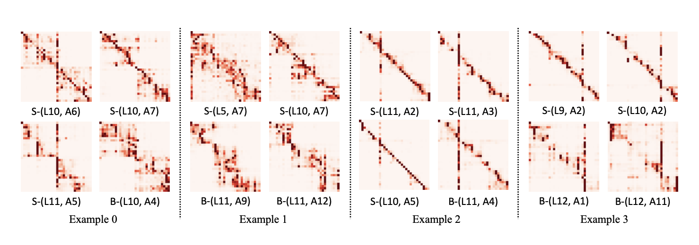
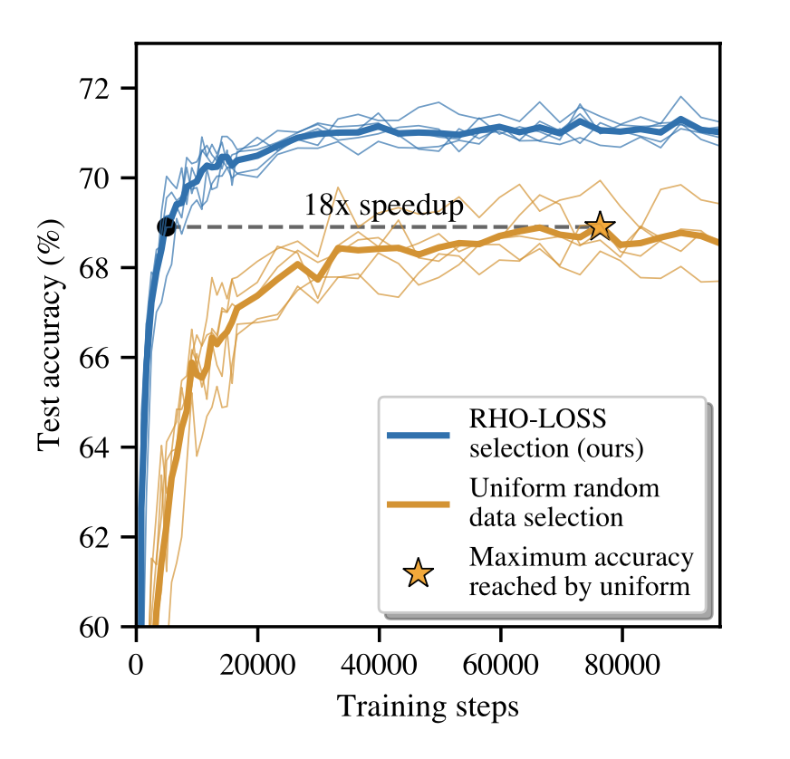

# Incremental Models

## Literature Review

#### Growing LSTMs

Growing LSTMs is a technique used to accelerate the training of deep learning models, particularly LSTMs, by incrementing the size of the model during training. A general heuristic decides when to add a block through two techniques: 
- **Cascade**: weights which come from an existing block are copied to the new block.
- **Fully Connected**: all hidden weights are modified. 

#### Layer Stacking

From the observation of layers: 
- Attention distribution on shallow layers is more uniform across different positions and layers. Distribution in shallow layers focuses on neighboring tokens + the starting token.
- Attention distribution in deep layers is similar to the distribution of shallow layers (knowledge can be shared).  

Layer stacking implies copying weights in new layers from the previous layers. This is a way to increase the depth, with an additional warm start.
At specific iterations the model doubles in size.

#### Layer Dropping

Layer dropping accelerates the training of Transformer-based language models. Transformer-based language models have achieved remarkable performance in many NLP domains, but the unsupervised pre-training phase of these models suffers from unbearable overall computational costs. Layer dropping is a method to accelerate the pre-training of these models, not at the cost of excessive hardware resources, but from the enhanced efficiency of modifying the model architecture and training technique. 

Layer dropping involves the random removal of layers from a neural network during training. This has the effect of reducing the depth of the network, which can speed up training. However, it has been observed that random removal of Transformer layers destabilises performance and easily results in serious consequences such as model divergence or convergence to an erroneous/suspicious local minimum

#### RHO

RHO-LOSS (Reducible Holdout Loss Selection) is a technique introduced to accelerate the training of deep learning models by selecting the most useful data points for training. Instead of training the model on all data points uniformly, RHO-LOSS selects the points that are most likely to reduce the generalisation loss of the model.

RHO-LOSS offers several advantages, including:
- Accelerated training: it can significantly reduce the number of training steps required to achieve a given accuracy, as demonstrated by experiments on various datasets, including the large dataset of web-scraped Clothing-1M images
- Improved accuracy: in addition to accelerating training, RHO-LOSS can also lead to improved final accuracy of the model
- Robustness: RHO-LOSS has proven effective across a wide range of datasets, hyperparameters and architectures, suggesting its robustness and general applicability

#### LiGO

LiGO is a technique used to accelerate the training of deep learning models, particularly Transformers, by reusing weights from smaller pre-trained models. The key idea is to map the weights of the pre-trained model to those of the target (larger) model using a linear growth operator that expands the weights of the pre-trained model to those of the target model.

Claims of LiGO:
- FLOPS: -40%
- Wall-clock time: -50%
- Params: ??

#### Mango Operator

The Multi-linear Operator (MANGO) is a technique used to accelerate the training of deep learning models, particularly Transformers, by reusing weights from smaller pre-trained models. The key idea is to map the weights of the pre-trained model to those of the target (larger) model using a multi-linear operator that captures correlations between all the weights in the model.

Previous methods for reusing pre-trained models, such as bert2BERT and LiGO, focused on mapping only part of the weights, ignoring potential correlations between the entire model. For example, bert2BERT expands the width of the model head by head in Transformers, while LiGO focuses mainly on extending weights of the same type (e.g. query, key and value in Transformers). This partial mapping approach may not be able to capture all useful information from the pre-trained model and lead to sub-optimal training. 
MANGO addresses this problem by considering the interaction between all model weights. Instead of a partial mapping, MANGO proposes a complete mapping that linearly links each target model weight to all pre-trained model weights. This approach makes full use of the correlations between the weights and results in a more accurate mapping.

The direct use of a full mapping operator would involve a huge parameter tensor, making the process computationally prohibitive. To overcome this obstacle, MANGO uses a multi-linear decomposition, specifically the ring tensor matrix product operator (TR-MPO), to decompose the large mapping tensor into four smaller tensors. This decomposition significantly reduces spatial and computational complexity, making MANGO practical to implement.

The main advantages of MANGO are:
- **Faster training speed**: MANGO significantly speeds up the training of large models compared to training from scratch or using partial mapping methods.
- **Improved accuracy**: MANGO can lead to models with better performance than previous methods, as it can better capture correlations between model weights.
- **General applicability**: MANGO can be applied to different types of Transformer models, as demonstrated by experiments on DeiT, BERT and GPT.

How to apply MANGO?
- Concatenate weights of pretrained model to construct Mi matrix
- Train growth operator ϕ
- Recover weight tensor M2 with multi linear operator
- Split M2 weights

#### Lion

#### Selective Backpropagation

#### Efficient Training for Transformers

Three categories of methods to accelerate training of Transformers:
- Dynamic architectures: layer dropping, layer stacking
- Batch selection: RHO-LOSS, selective backpropagation
- Efficient optimizers: Lion

How to compare training? 
- Iterations: BAD, may change time per iteration
- FLOPS: BAD, not taking into account parallelism
- Wall-clock time: BAD, fluctuates even when using the same HW
- Reference time system: GOOD --> how to calculate? 

RTS = time_per_iteration_compute * time_per_iteration_on_reference_system

Results:
- Dynamic architectures: no improvement
- Batch selection: no improvement
- Efficient optimizers: no improvement

## RNNs Shortcomings

- Are not guided in the compression process of information (there is probably a better way for them to learn important tokens). 
- How do we learn the important tokens? We understand the context. 

Or maybe we just base importance on the length of the token. How do we know the importance of a token if we encode it in a fixed size vector? 
Size dependant encoding?

IMP: this doesn't work with images. 