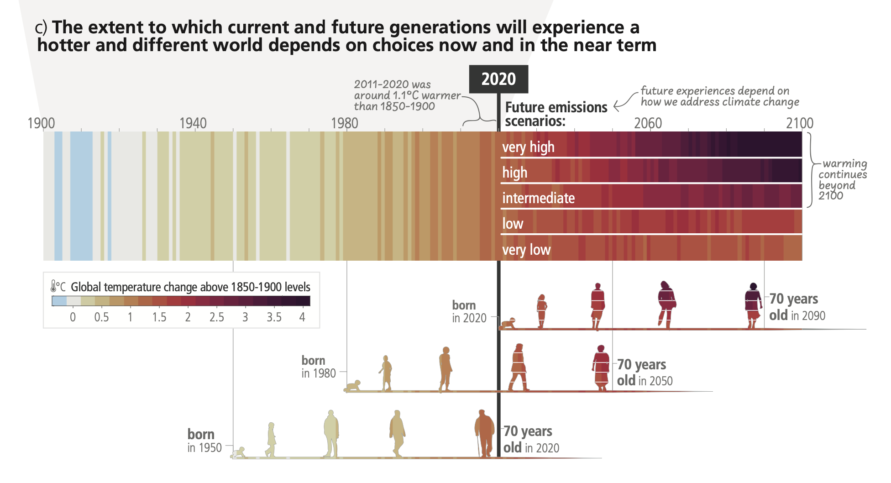
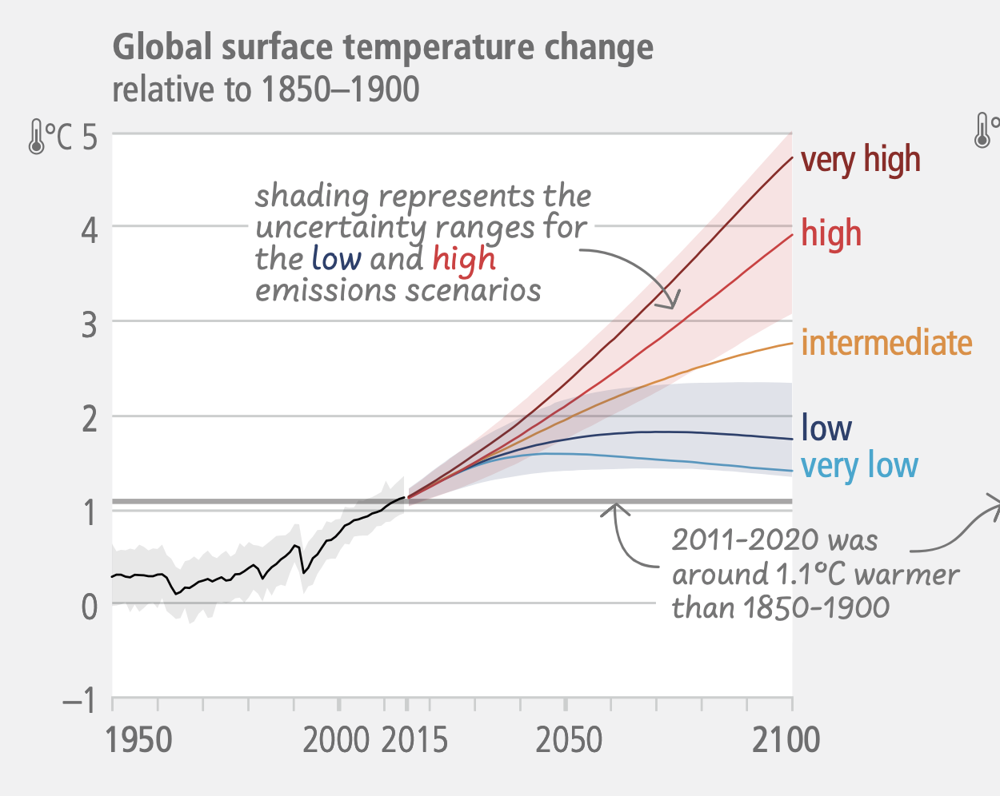
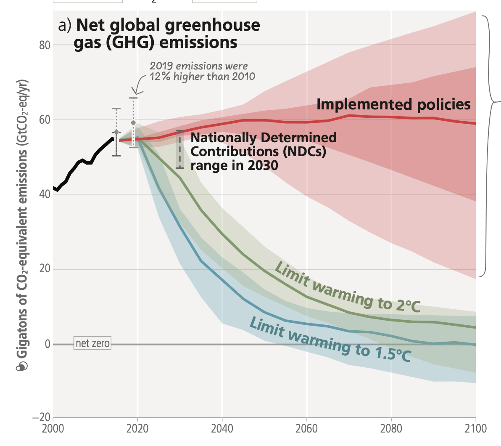

# IPCC Assessment Report 6 

## Introduction 

Assessment Report (AR6) summarises the state of knowledge of climate change, its widespread impacts and risks, and climate change mitigation and adaptation. It integrates the main findings of the Sixth Assessment Report (AR6) based on contributions from the three Working Groups

## Current Status and Trends

Human activities, principally through emissions of greenhouse gases, have unequivocally caused global warming, with global surface temperature reaching 1.1°C above 1850-1900 in 2011-2020. 
The likely range of total human-caused global surface temperature increase from 1850–1900 to 2010–20197 is 0.8°C to 1.3°C, with a best estimate of 1.07°C. 

Widespread and rapid changes in the atmosphere, ocean, cryosphere and biosphere have occurred. Human-caused climate change is already affecting many weather and climate extremes in every region across the globe. This has led to widespread adverse impacts and related losses and damages to nature and people. Vulnerable communities who have historically contributed the least to current climate change are disproportionately affected. 

Approximately 3.3 to 3.6 billion people live in contexts that are highly vulnerable to climate change. Human and ecosystem vulnerability are interdependent. Regions and people with considerable development constraints have high vulnerability to climatic hazards.

``` admonish warning
Impacts on some ecosystems are approaching irreversibility such as the impacts of hydrological changes resulting from the retreat of glaciers, or the changes in some mountain and Arctic ecosystems driven by permafrost thaw.  
```

Climate change has reduced food security and affected water security, hindering efforts to meet Sustainable Development Goals. 
In all regions increases in extreme heat events have resulted in human mortality and morbidity. The occurrence of climate-related food-borne and water-borne diseases and the incidence of vector-borne diseases have increased. In assessed regions, some mental health challenges are associated with increasing temperatures. 



Adaptation planning and implementation has progressed across all sectors and regions, with documented benefits and varying effectiveness. Despite progress, adaptation gaps exist, and will continue to grow at current rates of implementation. 

Growing public and political awareness of climate impacts and risks has resulted in at least 170 countries and many cities including adaptation in their climate policies and planning processes. 
Maladaptation especially affects marginalised and vulnerable groups adversely. 
Key barriers to adaptation are limited resources, lack of private sector and citizen engagement, insufficient mobilization of finance (including for research), low climate literacy, lack of political commitment, limited research and/or slow and low uptake of adaptation science, and low sense of urgency. 

Policies and laws addressing mitigation have consistently expanded since AR5. Global GHG emissions in 2030 implied by nationally determined contributions (NDCs) announced by October 2021 make it likely that warming will exceed 1.5°C during the 21st century and make it harder to limit warming below 2°C. 
There are gaps between projected emissions from implemented policies and those from NDCs and finance flows fall short of the levels needed to meet climate goals across all sectors and regions. 

``` admonish note
From 2010 to 2019 there have been sustained decreases in the unit costs of solar energy (85%), wind energy (55%), and lithium-ion batteries (85%), and large increases in their deployment. 
```

Policies implemented by the end of 2020 are projected to result in higher global GHG emissions in 2030 than emissions implied by NDCs, indicating an ‘implementation gap’. 

## Future Climate Change, Risks, and Long-Term Responses

Continued greenhouse gas emissions will lead to increasing global warming, with the best estimate of reaching 1.5°C in the near term in considered scenarios and modelled pathways. Every increment of global warming will intensify multiple and concurrent hazards. 

Global warming will continue to increase in the near term (2021–2040) mainly due to increased cumulative CO2 emissions in nearly all considered scenarios and modelled pathways. In the near term, global warming is more likely than not to reach 1.5°C even under the very low GHG emission scenario and likely or very likely to exceed 1.5°C under higher emissions scenarios. 

With further warming, every region is projected to increasingly experience concurrent and multiple changes in climatic impact-drivers. Compound heatwaves and droughts are projected to become more frequent, including concurrent events across multiple locations. Projected regional changes include intensification of tropical cyclones and/or extratropical storms, and increases in aridity and fire weather. 

With every increment of global warming, regional changes in mean climate and extremes become more widespread and pronounced. Risks and projected adverse impacts and related losses and damages from climate change escalate with every increment of global warming. 
The level of risk will also depend on trends in vulnerability and exposure of humans and ecosystems. Future exposure to climatic hazards is increasing globally due to socio-economic development trends including migration, growing inequality and urbanisation. 



Some future changes are unavoidable and/or irreversible but can be limited by deep, rapid, and sustained global greenhouse gas emissions reduction. The likelihood of abrupt and/or irreversible changes increases with higher global warming levels. 
Deep, rapid, and sustained GHG emissions reductions would limit further sea level rise acceleration and projected long-term sea level rise commitment.

``` admonish warning
As warming levels increase, so do the risks of species extinction or irreversible loss of biodiversity in ecosystems including forests, coral reefs, and in Arctic regions. 
```

Adaptation options that are feasible and effective today will become constrained and less effective with increasing global warming. With increasing global warming, losses and damages will increase and additional human and natural systems will reach adaptation limits. 

Limiting human-caused global warming requires net zero CO2 emissions. Cumulative carbon emissions until the time of reaching net zero CO2 emissions and the level of greenhouse gas emission reductions this decade largely determine whether warming can be limited to 1.5°C or 2°C. All global modelled pathways that limit warming to 1.5°C (>50%) with no or limited overshoot, and those that limit warming to 2°C (>67%), involve rapid and deep and, in most cases, immediate greenhouse gas emissions reductions in all sectors this decade. 



If warming exceeds a specified level such as 1.5°C, it could gradually be reduced again by achieving and sustaining net negative global CO2 emissions. This would require additional deployment of carbon dioxide removal, compared to pathways without overshoot, leading to greater feasibility and sustainability concerns. Overshoot entails adverse impacts, some irreversible, and additional risks for human and natural systems, all growing with the magnitude and duration of overshoot. 

## Responses in the Near Term

There is a rapidly closing window of opportunity to secure a liveable and sustainable future for all. 
increased international cooperation including improved access to adequate financial resources, particularly for vulnerable regions, sectors and groups, and inclusive governance and coordinated policies. 

Deep, rapid, and sustained mitigation and accelerated implementation of adaptation actions in this decade would reduce projected losses and damages for humans and ecosystems. Delayed mitigation and adaptation action would lock in high-emissions infrastructure, raise risks of stranded assets and cost-escalation, reduce feasibility, and increase losses and damages. Near-term actions involve high up-front investments and potentially disruptive changes that can be lessened by a range of enabling policies. 

These system transitions involve a significant upscaling of a wide portfolio of mitigation and adaptation options. Feasible, effective, and low-cost options for mitigation and adaptation are already available, with differences across systems and regions. 

Prioritising equity, climate justice, social justice, inclusion and just transition processes can enable adaptation and ambitious mitigation actions and climate resilient development. Adaptation outcomes are enhanced by increased support to regions and people with the highest vulnerability to climatic hazards. 