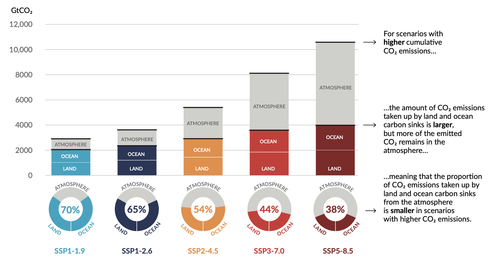

# IPCC Working Group 1

## A. The Current State of the Climate

It is unequivocal that human influence has warmed the atmosphere, ocean and land. Widespread and rapid changes in the atmosphere, ocean, cryosphere and biosphere have occurred.

Global mean sea level increased by 0.20 [0.15 to 0.25] m between 1901 and 2018. The average rate of sea level rise was 1.3 [0.6 to 2.1] mm yr–1 between 1901 and 1971, increasing to 1.9 [0.8 to 2.9] mm yr–1 between 1971 and 2006, and further increasing to 3.7 [3.2 to 4.2] mm yr–1 between 2006 and 2018 (high confidence). Human influence was very likely the main driver of these increases since at least 1971.

Human-induced climate change is already affecting many weather and climate extremes in every region across the globe. 

Improved knowledge of climate processes, paleoclimate evidence and the response of the climate system to increasing radiative forcing gives a best estimate of equilibrium climate sensitivity of 3°C. 

## B. Possible Climate Futures

Global surface temperature will continue to increase until at least mid-century under all emissions scenarios considered. Global warming of 1.5°C and 2°C will be exceeded during the 21st century unless deep reductions in CO2 and other greenhouse gas emissions occur in the coming decades.

Many changes in the climate system become larger in direct relation to increasing global warming. They include increases in the frequency and intensity of hot extremes, marine heatwaves, heavy precipitation, and, in some regions, agricultural and ecological droughts; an increase in the proportion of intense tropical cyclones; and reductions in Arctic sea ice, snow cover and permafrost. 

It is virtually certain that the land surface will continue to warm more than the ocean surface. It is virtually certain that the Arctic will continue to warm more than global surface temperature, with high confidence above two times the rate of global warming.

Continued global warming is projected to further intensify the global water cycle, including its variability, global monsoon precipitation and the severity of wet and dry events. Also, under scenarios with increasing CO2 emissions, the ocean and land carbon sinks are projected to be less effective at slowing the accumulation of CO2 in the atmosphere.

Many changes due to past and future greenhouse gas emissions are irreversible for centuries to millennia, especially changes in the ocean, ice sheets and global sea level.