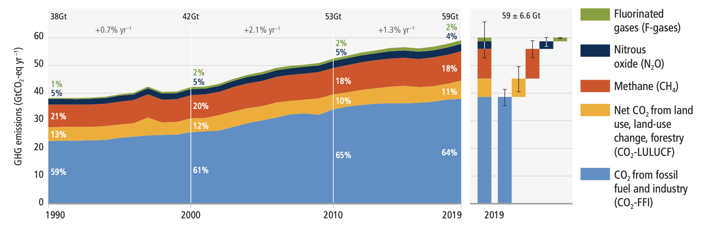
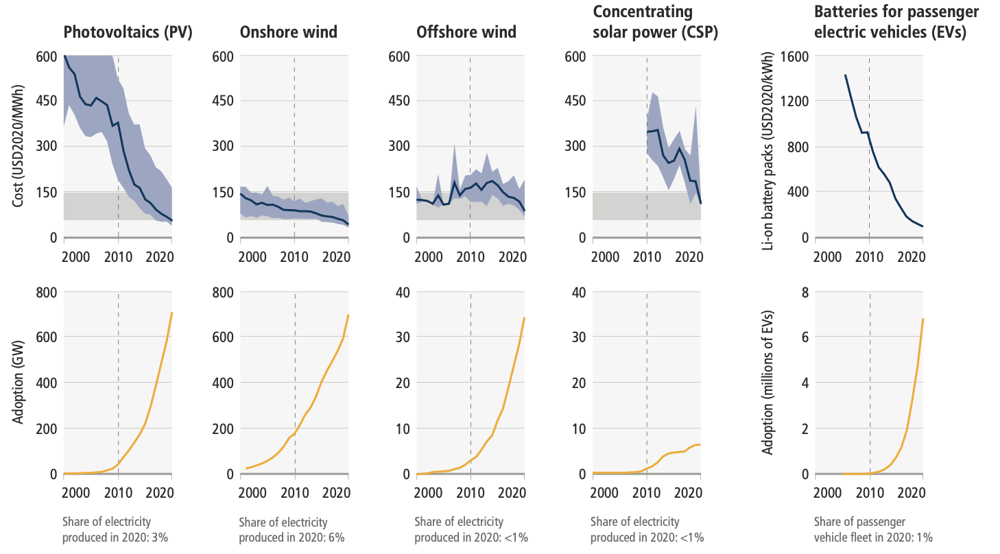
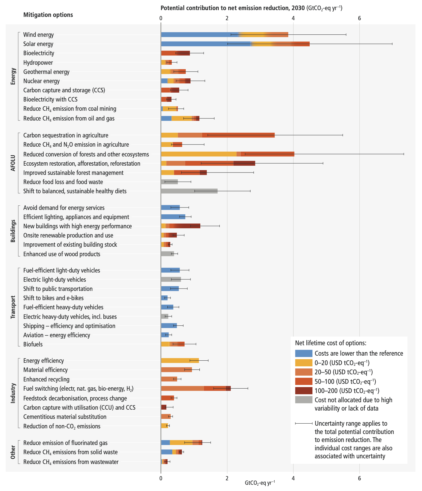

# IPCC Working Group 3

## Recent Developments and Current Trends

Total net anthropogenic GHG emissions6 have continued to rise during the period 2010–2019, as have cumulative net CO2 emissions since 1850. 
Regional contributions to global GHG emissions continue to differ widely. Variations in regional, and national per capita emissions partly reflect different development stages, but they also vary widely at similar income levels. The 10% of households with the highest per capita emissions contribute a disproportionately large share of global household GHG emissions. At least 18 countries have sustained GHG emission reductions for longer than 10 years. 

Globally, the 10% of households with the highest per capita emissions contribute 34–45% of global consumption-based household GHG emissions,21 while the middle 40% contribute 40–53%, and the bottom 50% contribute 13–15%.

The unit costs of several low-emission technologies have fallen continuously since 2010. Innovation policy packages have enabled these cost reductions and supported global adoption. 

There has been a consistent expansion of policies and laws addressing mitigation since AR5. This has led to the avoidance of emissions that would otherwise have occurred and increased investment in low-GHG technologies and infrastructure. Policy coverage of emissions is uneven across sectors.

Global GHG emissions in 2030 associated with the implementation of Nationally Determined Contributions (NDCs) announced prior to COP2623 would make it likely that warming will exceed 1.5°C during the 21st century.24 Likely limiting warming to below 2°C would then rely on a rapid acceleration of mitigation efforts after 2030.

## System Transformations to Limit Global Warming

Global GHG emissions are projected to peak between 2020 and at the latest before 2025 in global modelled pathways that limit warming to 1.5°C (>50%) with no or limited overshoot and in those that limit warming to 2°C (>67%) and assume immediate action. 
Without a strengthening of policies beyond those that are implemented by the end of 2020, GHG emissions are projected to rise beyond 2025, leading to a median global warming of 3.2°C by 2100. 

All global modelled pathways that limit warming to 1.5°C (>50%) with no or limited overshoot, and those that limit warming to 2°C (>67%), involve rapid and deep and in most cases immediate GHG emission reductions in all sectors. 

This would involve very low or zero-carbon energy sources, such as renewables or fossil fuels with CCS, demand side measures and improving efficiency, reducing non-CO2 emissions, and deploying carbon dioxide removal (CDR) methods to counterbalance residual GHG emissions.

Reducing GHG emissions across the full energy sector requires major transitions, including a substantial reduction in overall fossil fuel use, the deployment of low-emission energy sources, switching to alternative energy carriers, and energy efficiency and conservation. 

Net zero CO2 emissions from the industrial sector are challenging but possible. Reducing industry emissions will entail coordinated action throughout value chains to promote all mitigation options, including demand management, energy and materials efficiency, circular material flows, as well as abatement technologies and transformational changes in production processes.

Urban areas can create opportunities to increase resource efficiency and significantly reduce GHG emissions through the systemic transition of infrastructure and urban form through low-emission development pathways towards net-zero emissions. 

In modelled global scenarios, existing buildings, if retrofitted, and buildings yet to be built, are projected to approach net zero GHG emissions in 2050 if policy packages, which combine ambitious sufficiency, efficiency, and renewable energy measures, are effectively implemented and barriers to decarbonisation are removed.

The deployment of carbon dioxide removal (CDR) to counterbalance hard-to-abate residual emissions is unavoidable if net zero CO2 or GHG emissions are to be achieved. The scale and timing of deployment will depend on the trajectories of gross emission reductions in different sectors. 

Mitigation options costing USD100 tCO2-eq–1 or less could reduce global GHG emissions by at least half the 2019 level by 2030. 

