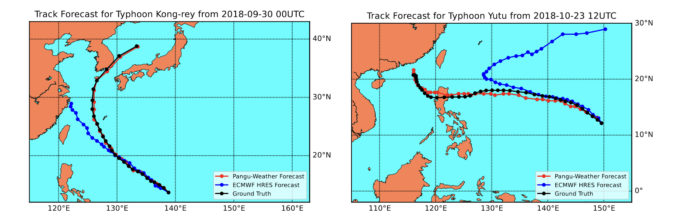
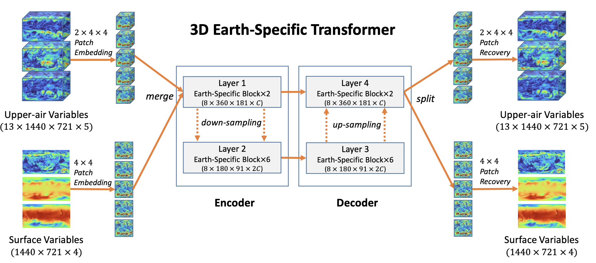

# PanguWeather

Pangu Weather is a transformer architecture trained on three dimensional weather variables, as opposed to Climax, where all data was two dimensional. The lead time
is also handled differently, with the model being trained to predict the weather at a certain time in
the future, as opposed to the approach taken in the ClimaX work, where the lead time is passed as
a parameter during the training phase. 

The former approach is more similar to the one used in this
project, where the simplicity of the dataset allows for a more straightforward implementation of the
lead time, sacrificing some flexibility in the process. Finally, the Pangu weather model features some
advanced techniques which separate it from all other competitors, namely the use of two different
resolutions for the encoding of each variable, allowing the model to capture both large scale and small
scale features, and use the attention mechanism to focus on different parts of the input data at the
same time. 

To achieve these two resolution, an encoder-decoder approach is used, where the encoder
is tasked with the downscaling of input variables, and the decoder is tasked with the upscaling of the
output. All transformer blocks are then applied to the output of the encoder, taking as input both
the low and high resolution information.