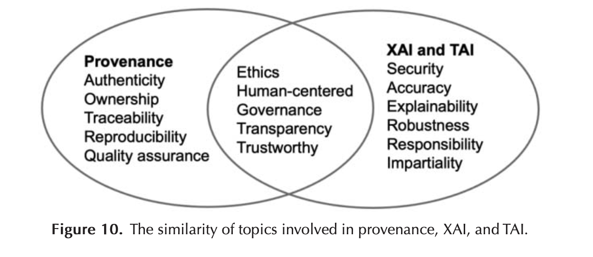

# Provenance documentation for XAI

Provenance documentation is one of the means to accomplish transparency, traceability, explainability, and reproducibility in AI-based systems. 

Inter-relationships between XAI, TAI, and provenance through a bibliometric analysis. 

