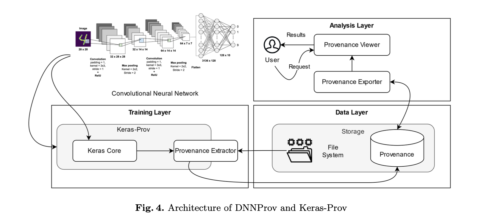

# Provenance Supporting Hyperparameter Analysis in DNNs

> [Paper](https://hal-lirmm.ccsd.cnrs.fr/lirmm-03324873/file/IPAW_2021_Authors.pdf) | No Code?

The lifecycle of a neural network depends on data configuration decisions that leads to obtaining a succesful model. 

Provenance can help in finding the correct configuration for a neural network.

How to capture provenance? 
- DNN prov 
- Keras prov

Both methods extend from DfAnalyzer, which is a provenance capturing tool for dataflow analysis. Both use the W3C PROV standard for provenance representation. 

For DNN prov, the provenance is captured at the level of the model, the layer, the tensor, the operation and the optimizer. The user chooses which data to capture, and has to define the data flow structure in the DNN workflow source code. 

These work across three layers: 
- **Training**: library executes model and interacts with Provenance Extractor.
- **Data**: the Provenance Extractor gets the files (json) containing the DNN information which is relevant. 
- **Analysis**: the Provenance Viewer generates visual representation by querying the provenance database.

Perpenti	Dell'Anna	Sengendo	Vincze	Padovani	Atanasova