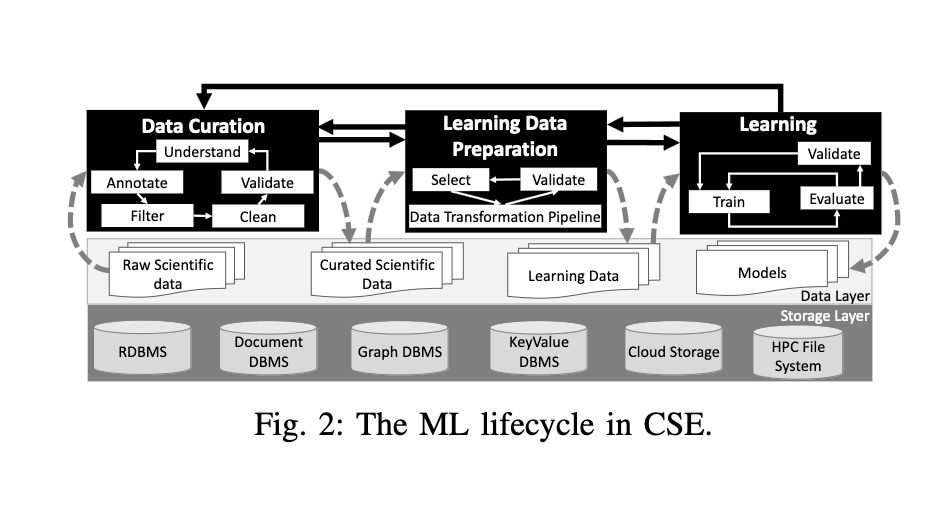

# Provenance Data in Machine Learning Lifecycle 

> [Paper](https://arxiv.org/abs/1910.04223) | No code?

## Introduction

If data is not tracked properly during the ML lifecycle, it becomes infeasible to recreate the model from scratch or to explain to stakeholders how it was created. The limitation of provenance tracking solutions is keeping the capturing overhead low. 

In this paper: 
- A new provenance data representation is proposed (PROV-ML). It is built on top of the W3C PROV standard and is designed to capture the provenance of data in the ML lifecycle. 
- A characterization of the provenance data in the ML lifecycle is provided.
- An extension to ProvLake, to support provenance tracking and analysis following the PROV-ML model is proposed.

Users often perform distinct types of analysis and have different provenance requirements. 

We can divide the ML lifecycle into the following stages:
- Data curation: is the most complex phase due to the nature of the data and the variety of sources. Much manual and highly specialized work is requiredm and there is a huge gap between raw scientific data and useful data consumption. Several data-intensive workflow scripts to clean, filter and validate the data are used. These scripts transform the raw data into a curated data. Each of these inner phases is highly interactive, manual and may have to be executed multiple times in an ad-hoc way. 
- Learning data preparation: model trainers select which parts of the curated data can be used for training. Several scripts are used to transform the curated data into a consistent dataset. Typical transformations include normalization, crop, quantization etc... (use of domain specific libraries). Data needs to be manually inspected to make sure it can be used as input for the learning phase. 
- Model training: model trainerd select the input for the training and testing splits, the model architecture, the hyperparameters and the optimization algorithm. One single training process often generates several models (and the best is taken). The process can be interrupted, re-submitted, re-run, etc...

## Characterization of Provenance in the ML Lifecycle

Provenance data in workflows contains a structured record of the data derivation paths within a chain of transformations, with parametrization of each transformation. 
Provenance data are often represented as a directed graph, where vertices represent instances of entities, activities or agents (data, data transformations or users) and edges represent the relationships between them.

A taxonomy is proposed to classify provenance analysis in support of ML: 

###### Data
Which includes: 
- Domain-specific: are the main data processed in the data curation phase. For raw data extraction, quantities of interest are extracted from large raw data files, and for for domain databases, relevant information and metadata are stored in knowledge graphs. 
- Machine learning: includes training data and generated training models. Parametrization and data transformation operations are important for provenacen tracking in this category.
- Execution: besides model performance metrics, users need to assess execution time and resource consumption of their workflow. Users need to inspect if a certain block in the workflow is consuming too much resources, or if the execution time is too long. For this, the system is able to capture system perfomance metrics and timestamps. 

###### Execution timing

Refers to whether the execution of the workflow is online or offline.
- Offline: the workflow is executed and the provenance data is captured after the workflow has finished. This is used to support reproducibility and historical results understaning. 
- Online: the workflow is executed in real-time, and the provenance data is captured in real-time. The user can inspect the provenance data while the workflow is running. The problem with this mode is that it tends to add high provenance capturing overhead.

###### Training timing

Refers to the analysis of performance intra-training to inspect one training process, or inter-training to compare different training processes.
- Intra-training: users are interested in understanding how trained models generated in a given context perform. 
- Inter-training: users are interested understanding how different training processes compare, which datasets were used, which hyperparameters were used, etc...

## ML Provenance Data Representation

The PROV-ML model is proposed to capture the provenance of data in the ML lifecycle. It is built on top of the W3C PROV standard. 
It inherits the benefits of ProvLake, enabling the integration of provenance of domain specific data processed by ML workflows in the data curation phase. 

ProvLake has been applied to capture provenance from multiple distributed workflows that consume that consume and generate data from and to heterogeneous data stores, while keeping the overhead low.

The architecture is build with five main components:
- ProvLake Library: a library that provides a set of APIs to capture and query provenance data. (PLLib)
- ProvTracker: a set of agents that capture provenance data from the execution of workflows.
- ProvManager: a set of agents that manage the provenance data captured by ProvTracker.
- PolyProvQueryEngine: a query engine that provides a set of APIs to query provenance data.
- Prov DBMS: a database management system that stores the provenance data captured by ProvTracker.

The workflows are instrumented with PLLib to capture provenance data. Users can add provenance data capture calls and a data capture task is run when a data trasnformation operation is executed. 
PLLib tries to keep execution overhead low while avoiding major modifications to the workflow scripts, all the while preserving the provenance data analytical capabilities. 

Provenance capture requests are queued and the maximum queue size is a configurable parameter. Moreover, users may chooose to store provenance information on disk only, rather than sending it to ProvTracker. 

ProvTracker uses prospective provenance data to provide for the tracking by creating the relationship of retrospective provenance data, being continuously sent by PLLib from multiple distributed workflows. It gives unique identifiers to every data value captured by the PLLib. 
ProvTracker has several work queues to group provenance requests before sending them to the ProvManager. 

ProvManager is a RESTful service that receives provenance data using ProvML vocabulary and transforms the data into RDF triples. 

Provenance queries are are provided by the PolyProvQueryEngine. 

## Execution Strategies on HPC Clusters

ProvLake uses a microservice architecture to achieve high flexibility when specifying how components are deployed to reduce performance penalties. 

PLLib is the only component in direct contact with the user workflow running on the cluster. To reduce communication cost between the user's workflow and PLLib, ProvTracker is deployed inside the cluster, on a seperate node.