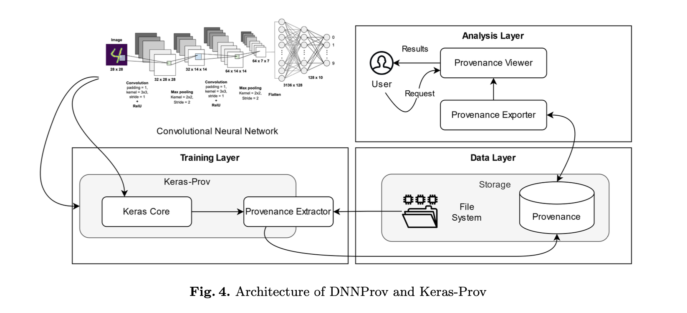

# Provenance Supporting Hyperparameter Analysis in DNNs

> [Paper](https://hal-lirmm.ccsd.cnrs.fr/lirmm-03324873/file/IPAW_2021_Authors.pdf) | No Code?

## Introduction

Deep Neural Networks (DNNs) are widely used in various applications, including image recognition, natural language processing, and climate modeling. The performance of DNNs is highly dependent on the choice of hyperparameters, such as the learning rate, batch size, and the number of layers. The choice of hyperparameters can significantly affect the performance of DNNs, and it is often challenging to determine the best hyperparameters for a given task. In this document, we discuss the importance of provenance in supporting hyperparameter analysis in DNNs. 

## Techniques

#### Automatic approaches

 - ModelDB: focuses on SparkML and Scikit-learn models, automatically tracks models in their native environments, storing results t oallow for visualization and exploration. Allows only for post-mortem analysis of the pipeline (no runtime provenance analysis).
 - Runaway: manages ML and DL artifacts, experiments and provenance. Tracks model and data for reproducibility and provenance. Is restricted to only python3.  
 - ModelKB (knowledge base): automatically extracts metadata artifacts from ML models. Automatically manages experiments, viewing and consulting. The issue is that there is no runtime provenance analysis. 
 - Shelter: Automated tool to extract metadata from ML models. Features an interactive view, querying of data and comparison of experiments. It does not follow W3C PROV standards.

#### Domain agnostic approaches

- NoWorkflow: captures and stores provenance data from python scripts. Doesn't support distributed or parallel execution.
- SPADE: same to NoWorkflow, but also includes support for parallel and distributed execution. It needs to be compiled with LLVM. The process consists in first automatically collecting data, then the used decides how to process. (no control over the type of data collected)
- DFAnalyzer: also allows the user to decide what to collect, but it is not automatic.
- Sumatra: captures data based on annotations in the script (only post mortem analysis).
- YesWorkflow: also annotations in the script, but no runtime provenance. 
- UML2PROV: uml based provenance collection, automatically allows for provenance aware apps. Has limited use in many ML environments.

Also tensorflow and keras have their own provenance tracking tools, but only post mortem. 

#### DNN specific approaches

- KerasProv: extends DfAnalyzer to support Keras models. It is also *in-situ*. Represents data in a way which follows W3C PROV standards. Can also create diagrams with pygraphviz.

The lifecycle of a neural network depends on data configuration decisions that leads to obtaining a succesful model. 

Provenance can help in finding the correct configuration for a neural network.

How to capture provenance? 
- DNN prov 
- Keras prov

Both methods extend from DfAnalyzer, which is a provenance capturing tool for dataflow analysis. Both use the W3C PROV standard for provenance representation. 

For DNN prov, the provenance is captured at the level of the model, the layer, the tensor, the operation and the optimizer. The user chooses which data to capture, and has to define the data flow structure in the DNN workflow source code. 

These work across three layers: 
- **Training**: library executes model and interacts with Provenance Extractor.
- **Data**: the Provenance Extractor gets the files (json) containing the DNN information which is relevant. 
- **Analysis**: the Provenance Viewer generates visual representation by querying the provenance database.

