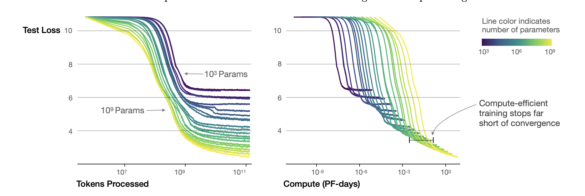
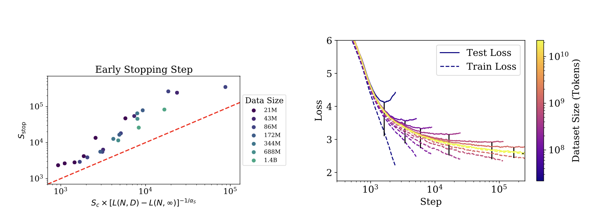

# Scaling Laws for Large Language Models

## Introduction

Analysis of cross entropy loss for LLMs. It scales as power law with regards to model size N, dataset size D, and amount of computation for training C. 
Network depth and width have minimal effect on the scaling. 

``` admonish note
Equations govern the dependence between overfitting and training speed. 
```

## Takeaways

- Performance depends on scale, so number of parameters, amount of data, and amount of computation.
- Performance depends weakly on network depth and width. 
- Smooth parameters: performance has a power law dependence with N, D and C.
- Performance is good if \\(N \approx D \\). Performance penalty depends approximately on the ratio \\(N^{0.74}/D\\). So by increasing the model size by 8x, we would need 5x the data to maintain performance and avoid penalty. 
- These networks are more sample efficient compared to smaller networks. 
- Convergence is inefficient, optimal performance is obtained when stopping shortly of convergence. 
- Optimal batch size is a power of the loss only. It can be calculated by measuring the gradient noise scale.

## Scaling Laws

- \\( L(N) = (\frac{N_c}{N})^\alpha_N\\) is the loss by keeping the number of parameters fixed.
    where \\(N_c \approx 8.8 \times 10^{13} \\) and \\(\alpha_N \approx 0.076\\). 
    If we increase model size then the dataset size has to be increased linearly, according to \\(D \approx N^{0.74}\\).
- \\( L(D) = (\frac{D_c}{D})^\alpha_D \\) is the loss by keeping the dataset size fixed.
- \\( L(C_{min}) = (\frac{C^{min}_c}{C^{min}})^{\alpha^{min}_c} \\) is the loss by keeping the amount of computation fixed.

Each \\( \alpha \\) parameter indicates the degree of performance improvement with respect to the parameter. 



#### Critical Batch Size

The critical batch size is used for understanding the tradeoff speed-efficiency for data parallel training. 
It also obeys the power law L. 

\\( B_{crit}(L) = \frac{B_*}{L^{\frac{1}{\alpha_B}}} \\)

where \\(B_* \approx 2^{8}\\) and \\(\alpha_B \approx 0.21 \\).

Critical Batch size follows the same scaling laws as performance increases. It needs to be increased by a factor of 2 for every 13% decrease in loss. In the same way, it is indipendent of network depth and width and model size.

\\( B_{crit}(L) = E_{min} / S_{min} \\)

where \\(E_{min}\\) is the minimum amount of samples needed to be processed and  \\(S_{min}\\) is the minimum amount of steps needed to reach the L. 

## Early Stopping

Overfitting is proportional to the correction from ending training at \\( S_{stop} \\), where \\( S_{min} \approx S_{stop} \\). Also this needs to be an under-estimation, as test loss decreases slower than training loss.



\\( S_{stop}(N, D) \geq \frac{S_{min}}{[L(N, D) - L(N, \inf)]^{\frac{1}{\alpha_s}}} \\)

where \\( L(N, \inf) \\) is the converged loss after training on infinite data. 

``` admonish note
The more data we have (dataset size D), the less overfitting we have.
```