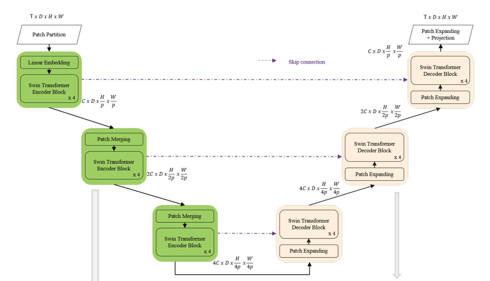

# Spatio-Temporal Swin-Transformer

Input to the model is 4D with the addition of the temporal dimension.

The input video is defined to be of size T×H×W×3, tokenization is 2x4x4x3: 
In Video Swin Transformer, we treat each 3D patch of size 2×4×4×3 as a token, while the channel size is not patchified.

Spatial downsampling is applied to reduce the embedding space.
We used a fully connected layer to scale up the dimension of the incoming data. 

The proposed network is tested on the Weather4Cast2021 weather forecasting challenge
data, which requires the prediction of 8 hours ahead future frames (4 per hour) from an hour weather product sequence.

This paper used 3D patch embedding, 3D shifted window multi-head self attention as well as patch merging.
This paper has 2d variables as channel dimension is not patchified.
In my case we'll need to create 4D patch embedding as also height layer has to be partitioned.
