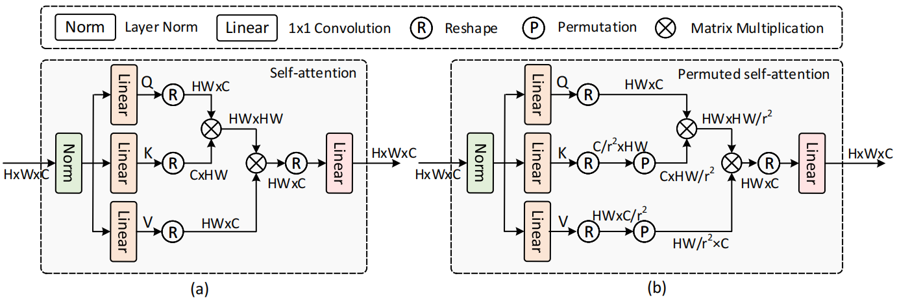

# SRFormer

Introduces permuted self attention, which can be added to the normal window self-attention. 

How do we increase the attention window without increasing the complexity?

Given a feature map **X** and a token reduction factor **r**, we first split X into non overlapping square windows with side length **S**. The result is then passed through 3 linear layers to get Q, K and V. 

Compress K and V size to \\( \frac{NS^2}{r^2C} \\), then permute the spatial tokens in K and V to the channel dimension, obtaining K_p and V_p.

The self-attention window size becomes \\( \frac{S}{r} \times \frac{S}{r} \\), but C is unchanged.

The performance gain is obtained when downscaling the spatial dimension, as the complexity of the attention mechanism is reduced. 

