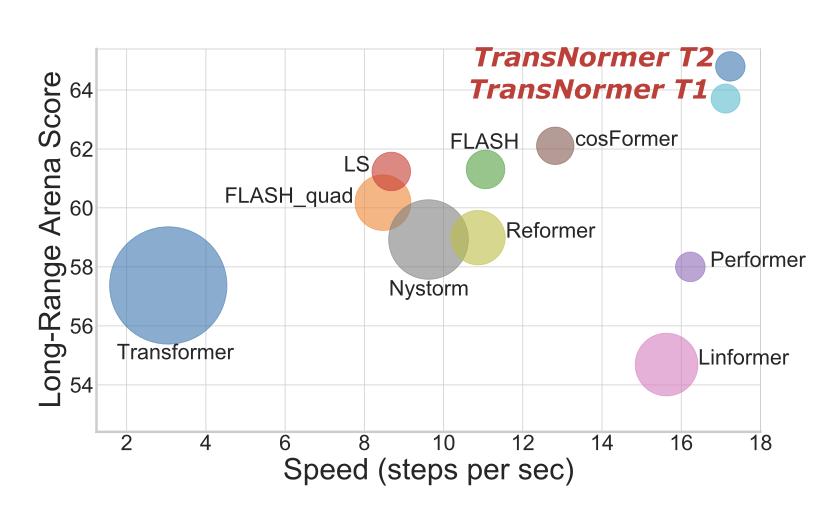
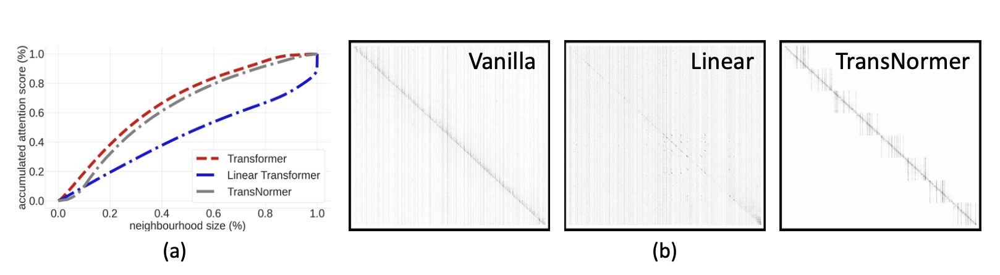

# The Devil in Linear Transformers

> [Paper](https://arxiv.org/abs/2210.10340) | [Code](https://github.com/OpenNLPLab/Transnormer)

## Summary 

Kernel based linear transformer have two main problems:
- Unbounded gradients: which negatively affect convergence (the problem comes from the scaling of the attention matrix); 
- Attention dilution: which trivially distributes attention scores along large sequences. 

The authors propose a solution to both problems by introducing a new model, the Transnormer. 
The idea is to used vanilla attention, which is more accurate and causes less dilution, in conjunction with linear attention, which is more efficient and scalable. 
- Diagonal attentin is used for the early stages of the network, to address dilution;
- Norm attention is used in later stages, to stabilize training gradients. 

Can we just remove scaling from linear attention? No, because it would cause a drop in accuracy (ppl). 
The cause is that the attention map becomes unbounded in the forward pass. We want to bound attention map in forward, as well as gradients in backward pass. 

Attention without scaling can be calculated as follows:

\\( O = Q(K^TV) \\)
\\( O_{norm} = X_{norm}(Q(K^TV)) \\)

where \\( X_{norm} \\) is a normalization layer.

Diagonal attention on the other hand is created by leveraging a non-overlapping blocks strategy for the attention distribution. This reduces time complexity as attention is calculated inside each block.

Complexity is given by:

\\( O(nwd) \\)

where \\( n \\) is the sequence length, \\( w \\) is the block size, and \\( d \\) is the feature dimension.

This concludes that these models require global attention in later stages, while local attention is sufficient in early stages. 

Do Vision transformers share the same issues?