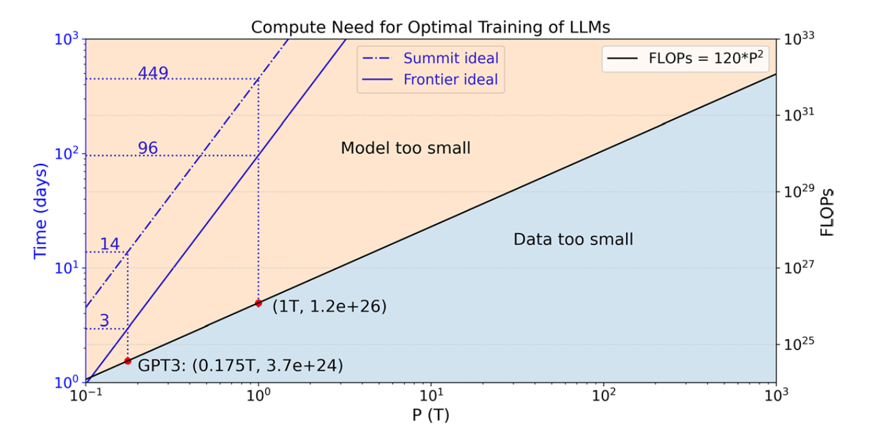
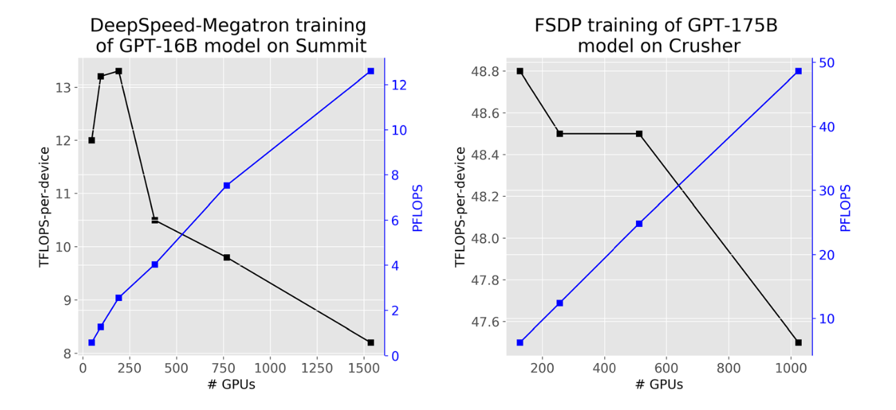

# Evaluation of pre‐training large language models on leadership‐class supercomputers

> [Paper](https://link.springer.com/article/10.1007/s11227-023-05479-7)


## Introduction

The training of large language models (LLMs) is compute intensive and requires large amounts of data. The environmental impact of developing and training LLMs must be kept in mind. 

Contributions include: 
- Estabilishing performance baselines by benchmarking two LLMs training frameworks
- Developing cost models for runtime and energy projections. 
- Drawing insights on future platforms for training LLMs

Two distributed training methods are tested: pytorch's **fsdp** and **Deepspeed**

## Scaling Laws of Transformers

The accuracy of DL models scales with the amount of data used. 
The loss of LLMs scales with both the training data and model parameters. Consequently, it scales with the amount of computation.

The total number of floating point operations (FLOPs) is approximately, 

\\( T_{FLOPS} ∼ 6 \times P \times D\\)

where P and D are number of model parameters and tokens, respectively. 

Compared to the attention and other blocks, the feed forward block typically requires the most computation. 
For each element of a feed-forward weight matrix, there are a total of 6 FLOPs per input token. The computation hence scales quadratically with the model size.

For example, training a 175B parameter GPT3 model requires \\(3.7×10^{24}\\) FLOPs, and it quickly grows to \\(1.2×10^{26}\\) FLOPs for a 1T parameter GPT-style model. 

With fsdp enabled, memory usage per device is: 

\\( M_A = M_{total} / N_{devices} = 6 * M_p / N_{devices} \\)

The per device communication volume per batch step, denoted by C_A, is \\(1.5\times \\) the one of DDP. 

\\( C_A ~ 3 \times M_p \\)

For DeepSpeed, the memory usage per device is: 

\\( M_B = \frac{M_p}{PP * TP} + \frac{M_o}{DP} + \frac{M_g}{PP * TP} + M_e \\)

So: 

\\( M_B = \frac{2 * ( DP + PP * TP +1 ) }{N_{devices}} * M_p \\)

While the per-device communication volume in each batch step is: 

\\( C_B ~ (\frac{TP}{N_{devices} + 1}) * 2 M_p \\)

Compared to fspd, Deepspeed has better parallelism scalability and can reach better performance when finetuned correctly. 

## Computational Analysis

The total number of compute operations needed for optimal training of LLMs is quadratically proportional to the number of model parameters. 

## Runtime and energy projection

the runtime can be straightforwardly predicted via

\\( t = T_{FLOPs}∕R_{FLOPs} \\)
\\( ∼ 120 \times P^2∕R_{FLOPs}, \\)

where \\(T_{FLOPs}\\) and \\(R_{FLOPs}\\) are the compute operations in FLOPs and training performance in FLOPS




The energy consumption can be evaluated by: 

\\(E = t \times R_{𝚆𝚊𝚝𝚝}\\)

where \\(R_{𝚆𝚊𝚝𝚝}\\) is the averaged power measured from few iterations.

For Summit and Crusher: the peak performance in half precision for the V100 (112 TFLOPS) and MI250X (384 TFLOPS) GPUs and linear scaling up to full system


#### Scaling analysis

To evaluate training, both Summit and Crusher (early access testbed for frontier) supercomputers at olcf have been used. 

The minimum model-parallel scale required to fit GPT-16B on summit is 2 nodes. 

Comparing training of GPT-1.4B and GPT-175B on fsdp and Crusher, the per device performance increases by 17%, indicating there exists a tipping point between the tradeoff of more computation and more communication. 

The training performance for FSDP and DeepSpeed-Megatron is 62.1 and 65.1 TFLOPS, respectively. From this baseline, the performance drops 20% and 44% for DeepSpeed-Megatron when using tensor parallelism within a NUMA domain and a node on Summit, respectively. The impact for FSDP is less (30% within a node compared to 44% for DeepSpeed-Megatron) due to less frequent communication and a smaller total message size. 

We scale up the LLMs training on both Summit and Crusher: 



The scaling efficiency is about 97%, signaling Frontier can be a promising platform for training LLMs of these model sizes

#### Energy consumption

To estimate the energy usage, we trace the GPU power in watts during the training for FSDP training of GPT 175B model on Summit and Crusher. 
One batch step takes 359 and 301 s, correspondingly. 

All processes show periodical behaviour due to the frequent allocation and deallocation of memory to fit large models.

The averaged power usage is about 85 and 408 Watts, for Summit and Crusher, respectively, and the corresponding computational efficiency is 0.165 and 0.235 TFLOPS/Watt.

Similarly, we trained GPT-1T with DeepSpeed on Summit and FSDP on Crusher. One batch takes 341 and 1290 seconds respectively. 

Compared to training GPT-175B, the power usage is significantly lower, indicating lower computational loads. 

Overall, Crusher is 2 orders of magnitude more efficient than Summit when training GPT-1T model.

As Crusher system bears the same architecture as the first Exascale system Frontier and their unprecedented mix-precision capability, we believe they are well-suited as the platform for training LLMs at extreme scale.

``` admonish important
One caveat to consider in our estimation is that the analysis is based on the current implementations of GPT-NeoX (DeepSpeed-Megatron) and PyTorch (FSDP). It’s important to note that the field is rapidly evolving, with ongoing advancements that can further reduce communication costs.
```

## Energy Projections

We projected the trainign time and energy consumption for training GPT-1.4B to GPT-1T on Summit and Frontier.

For larger models, a range is provided with the lower bound being 1x and 20x of the model parameters. Given the per-device computational performance, and the average power, the power efficiency can also be estimated. 

It turns out that Crusher is more energy-efficient for training LLMs, and the advatage grows rapidly. 

Training LLMs is over 4x more power efficient than executing traditional HPC workloads. (~52 GFLOPS/Watt)

## Conclusion

Compared to the theoretical peak performance of a device, there is a gap in how much performance can be achieved in practice when training LLMs, especially at scale. 
The achievable performance is about 40% of the theoretical peak. 

Accomodating a large model comes at the cost of additional communication and the performance at scale has another 3x and 2x orders of magnitude drop for Frontier and Summit respectively. 
The impact is larger on summit due to the per node memory being 5x smaller and hence more nodes are required to fit the model. Also the node bandwidth is 4x smaller.

For GPT-1T model using a senquence length of 2048 tokens, one GPU can fit 4 samples per batch. The ideal step time for linear scaling is: 

\\( t^{step} = \frac{T^{step}\_{FLOPs}}{R_{FLOPs}} \\)
\\( = 4.9 * 10^4 / R_{FLOPs} \\)

The minimum bandwidth required to achieve perfect scaling following communication volume C_A is:

\\( b_{ideal}(GB/s) = C_A / t^{step} = 0.24 * R_{FLOPs} \\)

For theoretical peak and achievable performance, the minimum per-device communication bandwidth needed is 37 and 94 GB/s, respectively.
The current 25 GB/s per-device on Crusher is not sufficient to support linear scaling for training GPT 1T model. 

We ignore I/O requirement in our analysis because it can be straightforwardly hidden among computations given the typical global batch size of millions of tokens. 

## Ideas

- Graph with Computation need (FLOPs) and ideal training time (days) assuming peak performance and perfect scaling for optimal training of LLMs on Summit and Frontier, respectively. This assumes perfect scaling --> can we do it with estimated scaling from Frontier?

- Compare real benchmarks with projections from Yin paper
