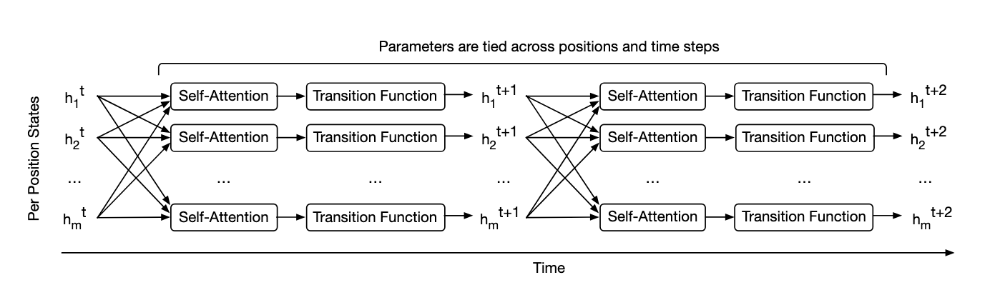

# Universal Transformers

> [Paper](https://arxiv.org/abs/1807.03819) | [Code](https://github.com/tensorflow/tensor2tensor)

RNNs: slow in training

Feedforward and conv architectures have achived better performance in many tasks, but transformers fail in generalizing for simple tasks. 

Universal Transformers: parallel in time, self-attentive RNN, combines recurrent nature + simple parallelization of transformers. It can also be tuting complete if given enough data (SOTA performance on many tasks).

UT refines a series of vector representations at each position of the sequence in parallel. It combines info with self-attention + recursive transition function across all time steps. 

How is efficiency? 

With enough computation, UT is computationally universal. 