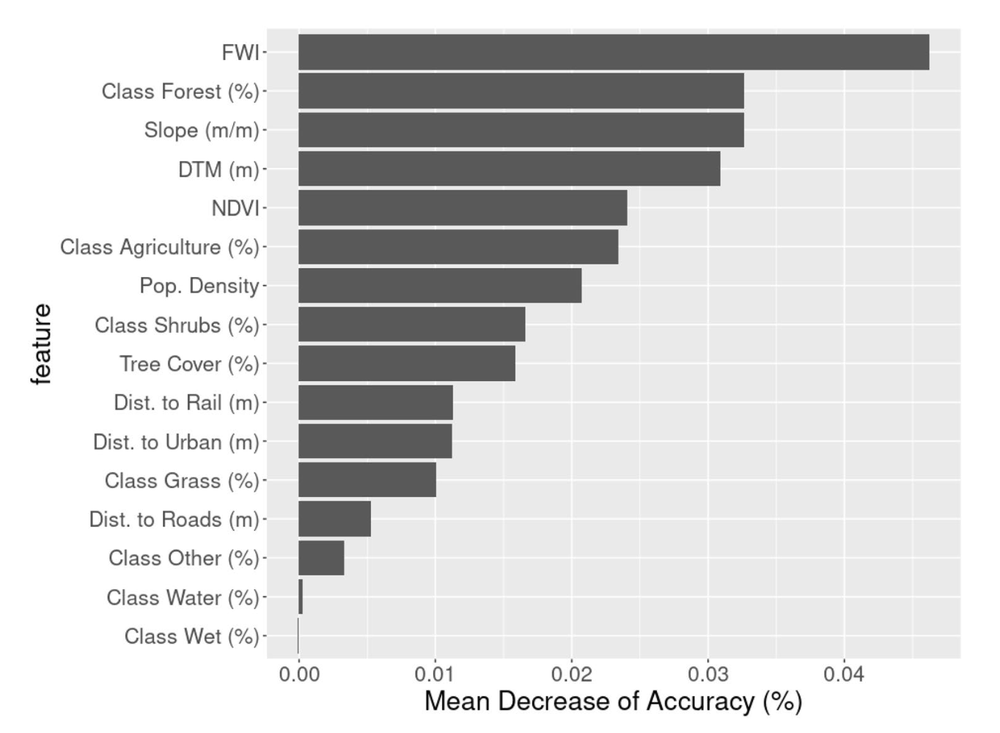

# XAI detects wildfire occurrence in the Mediterranean countries

## Introduction

attempt to provide an eXplainable artificial intelligence (XAI) framework for estimating wildfire occurrence using a Random Forest model with Shapley values for interpretation. 
Our findings accurately detected regions with a high presence of wildfires (area under the curve 81.3%) and outlined the drivers empowering occurrence, such as the Fire Weather Index and Normalized Difference Vegetation Index. 

## Methodology

explain which biophysical and/or human-related factors drive wildfire events over the Italian territory

 To this end, we designed a robust cross-validation framework to train a Random Forest (RF)24 model of Italian wildfires and evaluate the reliability of the available knowledge base; then, we performed an explainability analysis according to the Shapley paradigm

 Based on the record of previous wildfires, we trained a ML classification model to predict the probability of wildfire occurrence and thus provide, through the classification score, a measurement of wildfire risk in a specific grid point. We designed a stratified 5-fold cross-validation (CV) strategy to remove spatial correlation across adjacent grid points

## Explainaibility

In environmental sciences, the explainability of ML models is as important as prediction accuracy. Artificial intelligence models can be explained either at the global or local level. We esti- mated the global importance of a feature by measuring whether the inclusion or exclusion of the given feature from the model affected the algorithm’s performance on the validation set; 

to deal with possible feature importance biases due to input feature distributions, we estimated the significance of importance metrics with permutation

feature importance can be biased toward continuous features with uniform distribution or high-cardinality cat- egorical features30 and suggested the use of statistical tests based on permutations (PIMP method) to evaluate significant features

to explain how the algorithm made a specific decision locally and, therefore, to understand which factors explain wildfire occurrence, we adopted the Shapley paradigm32,33. The basic idea is borrowed from game theory: the features of a model are like the players of a game; cooperation is the key to win, or in the case of a learning model, to achieve the correct decision, but it should be noted that not all players/features yield the same contribution. The SHAP value of a feature j is introduced to evaluate such contributions by comparing how the classification scores change by including or removing this feature

## Results

To evaluate the informative content provided by the avail- able variables and the extent to which they are able to accurately describe wildfire susceptibility, we performed a binary classification and compared the CV performance with the out-of-bag error

